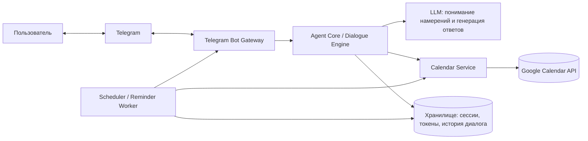
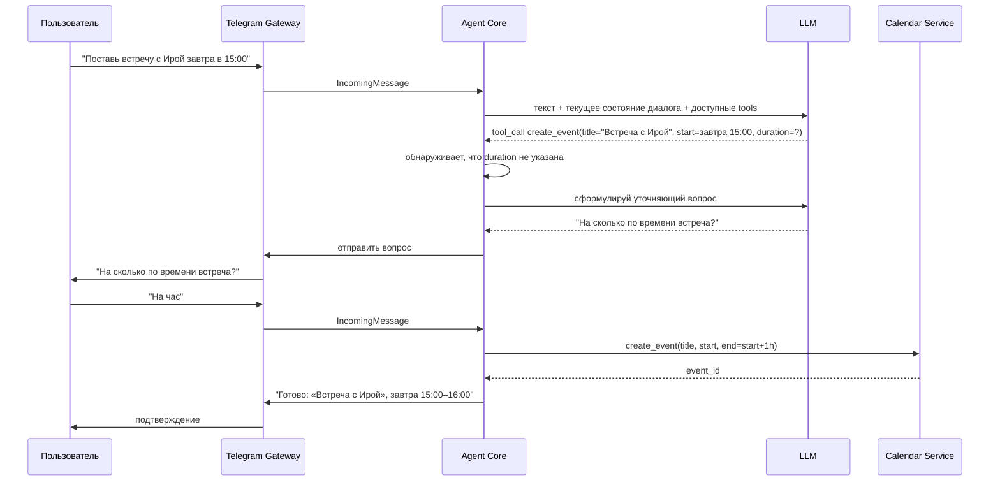

# MYW-13: Дизайн агента-календаря с интерфейсом в Telegram

Ссылка на тикет: https://linear.app/mywork1985/issue/MYW-13/predlozhi-dizajn

Статус: предложение (design proposal), реализация не начата.

## 1. Цель и контекст

Нужен агент, который:

- ведёт календарь пользователя (создаёт, изменяет, удаляет и показывает события);
- общается с пользователем интерактивно через Telegram, понимая запросы на
  естественном языке ("перенеси встречу с Ирой на пятницу", "что у меня завтра?");
- напоминает о предстоящих событиях.

Документ описывает архитектуру верхнего уровня, компоненты, поток данных,
модель данных, стек технологий и поэтапный план реализации. Код в этом
тикете не пишется — только дизайн.

## 2. Требования

### Функциональные

- Пользователь пишет боту в Telegram на естественном языке.
- Агент распознаёт намерение (создать / изменить / удалить / посмотреть
  событие) и извлекает параметры (дата, время, длительность, название,
  участники, место).
- Агент читает и пишет события в реальный календарь пользователя (Google
  Calendar как первый провайдер).
- Агент уточняет недостающие детали диалогом ("на какое время?"), а не
  падает или додумывает произвольные значения.
- Агент присылает напоминания о событиях (например, за 15 минут до начала).
- Один пользователь Telegram привязан к одному календарному аккаунту;
  поддержка нескольких независимых пользователей бота.

### Нефункциональные

- Секреты (токены Telegram, OAuth-токены календаря) не хранятся в открытом
  виде в коде или логах.
- Бот отвечает пользователю за разумное время (< 3с на подтверждение,
  результат календарной операции — асинхронно, если API медленное).
- Устойчивость к сбоям внешних API (Telegram, Google Calendar, LLM) —
  повторные попытки, понятные сообщения об ошибке пользователю.
- Возможность добавить второго календарного провайдера (например, CalDAV)
  без переписывания диалоговой логики.

### Вне рамок MVP

- Групповые чаты и расписания нескольких пользователей одновременно.
- Голосовые сообщения.
- Web/mobile-интерфейс — только Telegram.

## 3. Архитектура верхнего уровня

Компоненты работают как отдельные модули одного сервиса на старте (модульный
монолит), чтобы не усложнять деплой на MVP-этапе. Границы между модулями
проведены так, чтобы при необходимости вынести Scheduler или Calendar
Service в отдельный процесс/сервис это не потребовало смены интерфейсов.

## 4. Компоненты

### 4.1 Telegram Bot Gateway

- Получает обновления от Telegram (webhook предпочтительнее long polling в
  проде — меньше задержка, не нужен постоянный опрос).
- Валидирует, что сообщение пришло от привязанного пользователя (chat_id).
- Преобразует Telegram Update в внутреннее событие `IncomingMessage` и
  передаёт в Agent Core.
- Отправляет ответы, клавиатуры для подтверждений ("Создать встречу
  «Созвон» на 15:00 в пятницу? [Да] [Отменить]").

Технология: `aiogram` (async, удобные FSM-состояния для диалогов) или
`python-telegram-bot`.

### 4.2 Agent Core (Dialogue Engine)

- Хранит текущее состояние диалога с пользователем (какой сценарий сейчас
  выполняется: создание/изменение/просмотр, какие поля уже собраны).
- Вызывает LLM с function calling / tool use для:
  - извлечения намерения и сущностей (дата, время, título события) из
    свободного текста;
  - формулирования уточняющих вопросов;
  - формулирования финального ответа пользователю на естественном языке.
- Инструменты (tools), которые LLM может вызывать через Agent Core:
  `list_events`, `create_event`, `update_event`, `delete_event`,
  `find_free_slots`.
- Agent Core сам выполняет вызовы к Calendar Service — LLM не имеет прямого
  доступа к API календаря, только к описанным инструментам. Это позволяет
  валидировать и логировать каждый вызов.

### 4.3 Calendar Service

- Абстракция `CalendarProvider` с методами `list_events`, `create_event`,
  `update_event`, `delete_event`, `find_free_slots`, не зависящими от
  конкретного провайдера.
- Реализация `GoogleCalendarProvider` поверх Google Calendar API (OAuth2,
  refresh token хранится в Store, доступ запрашивается один раз при
  привязке аккаунта через `/connect`).
- Нормализует часовые пояса: все внутренние операции — в UTC, конвертация в
  часовой пояс пользователя происходит на границе с Telegram Gateway.

### 4.4 Scheduler / Reminder Worker

- Отдельный фоновый процесс (или periodic job), который раз в минуту
  проверяет предстоящие события через Calendar Service и шлёт напоминания
  через Telegram Bot Gateway.
- Хранит в Store, какие напоминания уже отправлены, чтобы не дублировать.
- Технология: APScheduler для MVP; при росте нагрузки — Celery + Redis/
  очередь задач.

### 4.5 Хранилище (Store)

- Таблица `users`: `telegram_chat_id`, `calendar_provider`, зашифрованные
  OAuth-токены, `timezone`.
- Таблица `dialogue_state`: текущий незавершённый сценарий и собранные
  поля (на случай перезапуска процесса посреди диалога).
- Таблица `sent_reminders`: `event_id`, `reminder_type`, `sent_at`.
- Технология: PostgreSQL (SQLite допустим для локальной разработки/MVP на
  одном пользователе).

## 5. Основной сценарий: создание события

Изменение и удаление событий следуют тому же паттерну: LLM определяет
намерение и находит целевое событие (по названию/времени, при
неоднозначности — уточняющий вопрос со списком кандидатов), Agent Core
вызывает соответствующий метод Calendar Service и просит подтверждения
перед деструктивными операциями (удаление, перенос).

## 6. Обработка ошибок и граничные случаи

- **Неоднозначная дата/время** ("на следующей неделе") — LLM обязан
  переспросить точную дату, а не выбирать самостоятельно.
- **Конфликт по времени** — Calendar Service возвращает пересекающиеся
  события, Agent Core предупреждает пользователя и предлагает варианты
  (создать всё равно / выбрать другое время).
- **Недоступен Google Calendar API** — повтор с экспоненциальной паузой
  (2–3 попытки), при неудаче — сообщение пользователю "не получилось
  сохранить, попробую ещё раз" и постановка операции в очередь повтора.
- **Просроченный/отозванный OAuth-токен** — бот просит пользователя заново
  выполнить `/connect`.
- **Rate limit Telegram/Google** — очередь исходящих сообщений с троттлингом
  в Gateway/Calendar Service.
- **Часовые пояса** — часовой пояс запрашивается один раз при подключении
  (`/connect`) и хранится в `users.timezone`; все даты, показываемые
  пользователю, конвертируются в этот пояс.

## 7. Безопасность

- OAuth-токены календаря хранятся зашифрованными (например,
  `cryptography.fernet` с ключом из секрет-менеджера/переменной окружения,
  не в git).
- Бот отвечает только привязанному `telegram_chat_id`; посторонние
  сообщения игнорируются с логированием попытки.
- Webhook Telegram защищён секретным путём/токеном (`secret_token` в
  `setWebhook`), сервер слушает только HTTPS.
- В логи не пишутся токены и полное содержимое календарных событий —
  только идентификаторы и метаданные, необходимые для отладки.

## 8. Технологический стек (предложение)

| Слой                     | Технология                                   |
|--------------------------|-----------------------------------------------|
| Telegram Gateway         | Python, `aiogram`                              |
| Agent Core / LLM         | Claude (Anthropic API), tool use / function calling |
| Calendar Service         | Google Calendar API (`google-api-python-client`) |
| Scheduler                | APScheduler (MVP) → Celery + Redis (рост нагрузки) |
| Хранилище                | PostgreSQL (prod), SQLite (dev)                |
| Деплой                   | Docker-контейнер, конфигурация через переменные окружения |
| Тесты                    | pytest, моки для Telegram API и Google Calendar API |

## 9. План поэтапной реализации

1. **MVP**: один пользователь, ручная привязка Google-аккаунта, команды
   создать/показать события, без LLM-парсинга (жёсткий формат команд) —
   чтобы проверить интеграцию Telegram + Calendar.
2. **NLU**: подключение LLM для разбора свободного текста и диалоговых
   уточнений поверх того же Calendar Service.
3. **Напоминания**: Scheduler/Reminder Worker.
4. **Мультипользовательность**: таблица `users`, привязка `/connect` для
   каждого чата отдельно.
5. **Устойчивость**: повторные попытки, очереди, метрики и алерты.

## 10. Открытые вопросы

- Какой календарный провайдер приоритетнее для первого релиза — только
  Google Calendar, или сразу нужен CalDAV/Outlook?
- Нужна ли поддержка нескольких календарей на одного пользователя
  (личный/рабочий)?
- Где будет развёрнут сервис (какой хостинг/инфраструктура уже используется
  в проекте) — это влияет на выбор между webhook и long polling, а также
  на выбор Scheduler (APScheduler в том же процессе vs. отдельный воркер).

Эти вопросы стоит закрыть перед тем, как заводить тикеты на реализацию
отдельных компонентов.
